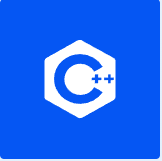

<!-- 
参考 https://github.com/anuraghazra/github-readme-stats/blob/master/docs/readme_cn.md
-->
<header align="center">
<link rel="stylesheet" href="_static/default.css">
<h1>Hi 👋, I'm xinetzone</h1>
<h2 class="profile-subtitle">A passionate AI developer from China</h2>
</header>

  

- 🔭 I’m currently working on [d2py](https://github.com/xinetzone/d2py)

- 🌱 I’m currently learning **Apollo, ROS2**

- 👯 I’m looking to collaborate on [daobook](https://github.com/daobook)

- 👨‍💻 All of my projects are available at [xinetzone](https://github.com/xinetzone)

- 📝 I regularly write articles on [xinetzone blog](https://xinetzone.github.io/)

- ⚒ Python/GitHub Actions, a little bit C++/JavaScript/PyQt5/PySide2

- 📦 Building [datasetsome](https://github.com/DataLoaderX/datasetsome) and more

- ✏️ VS Code, Markdown and RST

### 💬 Ask me about

I am glad to answer any development questions, career questions, technical team management questions, etc.

Please feel free to ask me if you have any of those.

### 📫 How to reach me

- 📧 xinzone@outlook.com

### Blogs posts

- 📝 Blog [cnblogs](https://www.cnblogs.com/q735613050/) | [简书](https://www.jianshu.com/u/4302480a3e8e) | [慕课网](https://www.imooc.com/u/5467447/articles)
- ❓ [知乎](https://www.zhihu.com/people/liu-xin-wei-55) | [Linkedin](https://www.linkedin.com/in/xinet)
- [Tensor Atom](https://tensoratom.github.io/)

### Connect with me

### Languages and Tools

   
  <a href="https://www.w3.org/html/" target="_blank" rel="noreferrer"> 

<!-- or locale=cn -->

### Quality projects created

